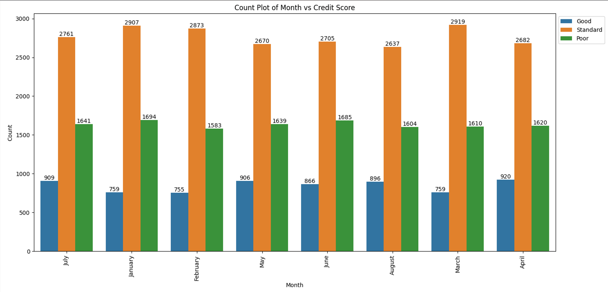

# Credit Score Prediction Using Machine Learning

## Table of Contents
- [Dataset Description](#Dataset Description)
- [Fields and Data Collection](#FieldsandDataCollection)
- [Data Overview](#DataOverview)
- [Prediction Objective](#PredictionObjective)
- [Process Overview](#ProcessOverview)
- [Models Used](#ModelsUsed)
- [Model Fitting](#ModelFitting)
- [Handling Overfitting/Underfitting](#HandlingOverfitting/Underfitting)
- [Production Advice](#ProductionAdvice)
- [Future Work and Improvements](#FutureWorkandImprovements)
- [Conclusion](#Conclusion)

## Dataset Description

This project utilizes several datasets involving financial and personal data points for individuals. These datasets include information such as ID, Customer_ID, Age, SSN, Occupation, Annual Income, Credit Score, and more. The data originates from a simulated financial dataset designed to resemble real-world scenarios in banking and credit scoring. The datasets are collected to explore patterns and model credit behavior, making them useful for credit risk assessment and financial product tailoring.

## Fields and Data Collection

The datasets comprise various fields, each contributing to a comprehensive profile of each customer:

- **Personal Details**: Includes identifiers and demographic information (e.g., ID, Name, Age).
- **Financial Metrics**: Covers financial status and behavior (e.g., Annual Income, Number of Bank Accounts, Credit Score).
- **Credit Information**: Details on credit history and current credit status (e.g., Credit Mix, Outstanding Debt).

These fields were compiled to mirror typical data used by financial institutions for assessing creditworthiness and financial stability.

## Data Overview

| Dataset                      | Rows   | Columns | Description                                                 |
|------------------------------|--------|---------|-------------------------------------------------------------|
| `train.csv`                  | 100,000| 28      | Raw training data                                           |
| `Train_Cleaned_Data.csv`     | 100,000| 27      | Cleaned and processed training data                         |
| `Train_Preprocessed.csv`     | 100,000| 27      | Preprocessed training data with feature engineering and encoding |
| `test.csv`                   | 25,000 | 53      | Raw test data                                               |
| `Test_Preprocessed.csv`      | 25,000 | 53      | Preprocessed test data ready for predictions                |
| `test_with_Predicted_Credit_Scores.csv` | 25,000 | 54 | Test data with the predicted credit scores included         |

### Columns Description for `train.csv`

| Column Name               | Description                                                            |
|---------------------------|------------------------------------------------------------------------|
| ID                        | Unique ID of the record                                                |
| Customer_ID               | Unique ID of the customer                                              |
| Month                     | Month of the year                                                      |
| Name                      | The name of the person                                                 |
| Age                       | The age of the person                                                  |
| SSN                       | Social Security Number of the person (removed during data cleaning)    |
| Occupation                | The occupation of the person                                           |
| Annual_Income             | The Annual Income of the person                                        |
| Monthly_Inhand_Salary     | Monthly in-hand salary of the person                                   |
| Num_Bank_Accounts         | The number of bank accounts of the person                              |
| Num_Credit_Card           | Number of credit cards the person has                                  |
| Interest_Rate             | The interest rate on the credit card of the person                     |
| Num_of_Loan               | The number of loans taken by the person from the bank                  |
| Type_of_Loan              | The types of loans taken by the person from the bank                   |
| Delay_from_due_date       | The average number of days delayed by the person from the date of payment |
| Num_of_Delayed_Payment    | Number of payments delayed by the person                               |
| Changed_Credit_Limit      | The percentage change in the credit card limit of the person           |
| Num_Credit_Inquiries      | The number of credit card inquiries by the person                      |
| Credit_Mix                | Classification of Credit Mix of the customer                           |
| Outstanding_Debt          | The outstanding balance of the person                                  |
| Credit_Utilization_Ratio  | The credit utilization ratio of the credit card of the customer        |
| Credit_History_Age        | The age of the credit history of the person                            |
| Payment_of_Min_Amount     | Yes if the person paid the minimum amount to be paid only otherwise no |
| Total_EMI_per_month       | The total EMI per month of the person                                  |
| Amount_invested_monthly   | The monthly amount invested by the person                              |
| Payment_Behaviour         | The payment behaviour of the person                                    |
| Monthly_Balance           | The monthly balance left in the account of the person                  |
| Credit_Score              | The credit score of the person                                         |

## Prediction Objective

The primary aim is to predict the 'Credit Score' of individuals based on their financial and personal data. This prediction can help financial institutions in decision-making processes regarding loan approvals, credit limits, and interest rates, ultimately aiding in risk management and personalized financial planning.

## Process Overview

### Project Narrative

The project followed an iterative approach starting with exploratory data analysis (EDA) to understand distributions and correlations followed by preprocessing steps such as handling missing values and encoding categorical data. Initial models provided baseline results with iterative improvements made by refining feature engineering and model parameters.

### Data Cleaning

Handled missing values and corrected inconsistencies in the data. This included:

- **Removing SSN**: The SSN column was removed to ensure data privacy.
- **Handling Missing Values**: Missing values in the `Monthly_Inhand_Salary` column were imputed using the median value.
- **Correcting Age**: Negative values in the `Age` column were corrected by replacing them with the median age.

### Feature Engineering

Created new features and transformed categorical variables into a numerical format suitable for machine learning models. This included:

- **Label Encoding**: The `Occupation` column was label encoded to convert categorical data into numerical format.
- **One-Hot Encoding**: The `Month` column was one-hot encoded to capture the cyclical nature of months.
- **Scaling**: Numerical features such as `Annual_Income` and `Outstanding_Debt` were scaled using StandardScaler.
- **Advanced Techniques**: Created a new feature `Debt_to_Income_Ratio` by dividing `Outstanding_Debt` by `Annual_Income`.

### Exploratory Data Analysis (EDA)

- **Variables**: 'X' variables include all customer-specific fields except 'Credit Score'. The 'Y' variable is the 'Credit Score'.
- **Type of Problem**: This is a regression problem aiming to predict a continuous outcome.
- **Observations**: The dataset contains 100,000 observations.
- **Feature Distribution**: Focus was on analyzing imbalanced features and understanding the distribution impact on model performance.

  **Distribution of Annual Income**
  


  **Distribution of Monthly Inhand Salary**
  


  **Distribution of Monthly Balance**
  


  **Distribution of Outstanding Debt**
  


- **Correlation and Feature Importance**: The correlation matrix helped identify multicollinearity and significant predictors. For instance, `Outstanding_Debt` and `Monthly_Balance` showed strong correlations with the target variable `Credit_Score`.

- **Count Plot of Month vs Credit Score**: Shows the relationship between the month and the credit score, highlighting any seasonal trends in credit scores.

  **Count Plot of Month vs Credit Score**



- **Count Plot of Occupation vs Credit Score**: Illustrates how different occupations relate to credit scores, providing insights into the influence of occupation on creditworthiness.

  **Count Plot of Occupation vs Credit Score**


- **Count Plot of Payment of Min Amount vs Credit Score**: Demonstrates the impact of paying the minimum amount on credit scores, which can be crucial for understanding financial behavior.

  **Count Plot of Payment of Min Amount vs Credit Score**


- **Count Plot of Payment Behaviour vs Credit Score**: Shows the distribution of Payment Bhaviour 

  **Pie Chart of Payment Behaviour**


- **Count Plot of Payment of Minimun Amount**: Shows the distribution of Payment of Minimun Amount

  **Pie Chart of Payment of Minimun Amount**


  **Correlation Matrix**


## Models Used and Validation Metrics
Several machine learning models were employed in this project. 
1.RandomForest Classifier
2.DecisionTree Classifier
3.XGBoost Classifier
Model performance was evaluated using metrics such as accuracy, precision, recall, and F1 score.

**RandomForestClassifier**

| Metric    | Score |
|-----------|-------|
| Precision | 0.79  |
| Recall    | 0.79  |
| F1 Score  | 0.79  |
| Support   | 5140  |

```plaintext
              precision    recall  f1-score   support

           0       0.78      0.79      0.79      1664
           1       0.81      0.81      0.81      2737
           2       0.74      0.72      0.73       739

    accuracy                           0.79      5140
   macro avg       0.78      0.78      0.78      5140
weighted avg       0.79      0.79      0.79      5140
```

### DecisionTreeClassifier
The DecisionTreeClassifier was one of the models used in this project. The performance metrics for this model are as follows:

| Metric     | Score |
|------------|-------|
| Precision  | 0.73  |
| Recall     | 0.73  |
| F1 Score   | 0.73  |
| Support    | 5140  |

```plaintext
              precision    recall  f1-score   support

           0       0.74      0.72      0.73      1664
           1       0.76      0.77      0.77      2737
           2       0.61      0.60      0.61       739

    accuracy                           0.73      5140
   macro avg       0.70      0.70      0.70      5140
weighted avg       0.73      0.73      0.73      5140
```

### XGBoostClassifier
The XGBoostClassifier was another model used in this project. The performance metrics for this model are as follows:

| Metric     | Score |
|------------|-------|
| Precision  | 0.78  |
| Recall     | 0.78  |
| F1 Score   | 0.78  |
| Support    | 5140  |

```plaintext
              precision    recall  f1-score   support

           0       0.77      0.78      0.77      1664
           1       0.80      0.80      0.80      2737
           2       0.72      0.68      0.70       739

    accuracy                           0.78      5140
   macro avg       0.76      0.75      0.76      5140
weighted avg       0.78      0.78      0.78      5140
```

### Model Fitting

The model fitting process involved training a `RandomForestClassifier` on the preprocessed training data. Key steps included:

- **Train/Test Split**: The dataset was split into 80% training and 20% testing sets to ensure a balanced representation.
- **Hyperparameter Tuning**: Optimizing the model parameters using `GridSearchCV` to find the best combination of parameters for the model.

| Model                   | Best Parameters                                  | Best Score | Validation Accuracy | Cross-Validation Scores                   | Mean CV Accuracy |
|-------------------------|--------------------------------------------------|------------|---------------------|-------------------------------------------|------------------|
| RandomForestClassifier  | {'bootstrap': True, 'max_depth': 30, 'n_estimators': 200} | 0.7785072695728552 | 0.7920233463035019 | [0.79163424, 0.79081533, 0.79081533, 0.78575598, 0.78925861] | 0.7896559005938415 |
| DecisionTreeClassifier  | {'criterion': 'entropy', 'max_depth': 10}       | 0.7256275040770372 | 0.7328793774319066 | N/A                                       | N/A              |
| XGBoostClassifier       | {'learning_rate': 0.2, 'max_depth': 7, 'n_estimators': 200} | 0.7657130508732858 | 0.775875486381323 | N/A                                       | N/A              |

## Handling Overfitting/Underfitting
Strategies used to handle overfitting and underfitting included:

- **Regularization**: Applying techniques like pruning trees in RandomForest to prevent overfitting.
- **Cross-validation**: Ensuring the model generalizes well to new data by using cross-validation.
- **Data Augmentation**: Increasing the size and variability of the training data to improve model robustness.

## Production Advice
For deploying this model in a production environment, consider the following:

- **Monitoring**: Continuously monitor model performance over time to detect any degradation.
- **Updating**: Regularly update the model with new data to maintain its accuracy and relevance.
- **Data Privacy and Security**: Ensure that customer data is handled securely and in compliance with data privacy regulations.

## Future Work and Improvements
Suggestions for further enhancing the model include:

- **More Data**: Collecting additional data to improve model generalization and robustness.
- **Additional Features**: Incorporating external economic indicators and other relevant features.
- **Advanced Feature Engineering**: Applying more sophisticated feature engineering techniques.
- **Model Training Techniques**: Experimenting with different models and ensemble methods to improve performance.

## Conclusion
This project successfully demonstrated the process of predicting credit scores using machine learning. The insights gained from EDA and the model's predictions can help financial institutions in assessing customer creditworthiness more effectively. Future improvements could include incorporating more data, additional features, and exploring advanced modeling techniques.


