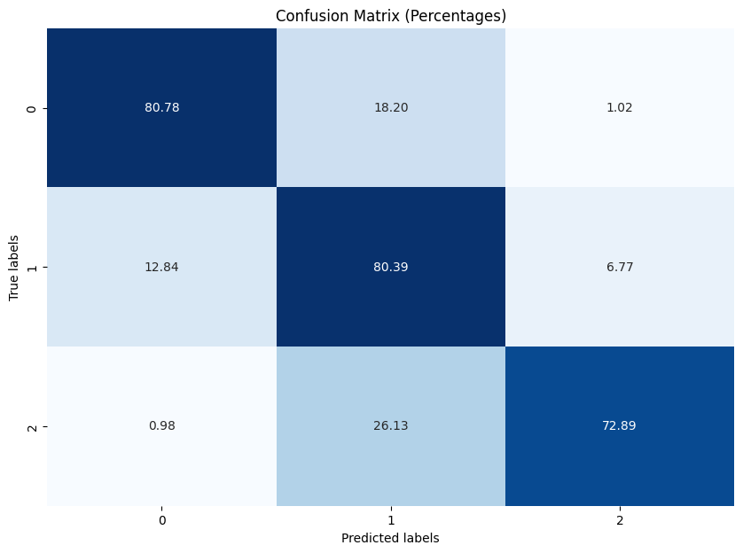

# Credit Score Prediction Using Machine Learning

## Final Project

**Presented By**:
- Shubham Patel
- Param Anand

**Guided By**:
- Professor Michael Gilbert
- G.A. Nisar Ahamad Killedar

## Introduction

This project utilizes several datasets involving financial and personal data points for individuals. These datasets include information such as ID, Customer_ID, Age, SSN, Occupation, Annual Income, Credit Score, and more. The data originates from a simulated financial dataset designed to resemble real-world scenarios in banking and credit scoring. The datasets are collected to explore patterns and model credit behavior, making them useful for credit risk assessment and financial product tailoring.

## Table of Contents
- [Prediction Objective](#prediction-objective)
- [Data Overview](#data-overview)
  - [Dataset Link](#dataset-link)
  - [Fields and Data Collection](#fields-and-data-collection)
  - [Columns Description for train.csv](#columns-description-for-traincsv)
- [Process Overview](#process-overview)
  - [Project Narrative](#project-narrative)
  - [Data Cleaning](#data-cleaning)
  - [Exploratory Data Analysis (EDA)](#exploratory-data-analysis-eda)
  - [Feature Engineering](#feature-engineering)
- [Models Used and Validation Metrics (Initial Modeling)](#models-used-and-validation-metrics-initial-modeling)
  - [RandomForestClassifier](#randomforestclassifier)
  - [DecisionTreeClassifier](#decisiontreeclassifier)
  - [XGBoostClassifier](#xgboostclassifier)
- [Hyperparameter Tuning](#hyperparameter-tuning)
  - [Handling Overfitting/Underfitting](#handling-overfittingunderfitting)
- [Confusion Matrix](#confusion-matrix)
- [Outputs](#outputs)
  - [Predictions](#predictions)
- [Production Advice](#production-advice)
  - [Steps](#steps)
- [Future Work and Improvements](#future-work-and-improvements)
- [Conclusion](#conclusion)

## Prediction Objective

The primary aim is to predict the 'Credit Score' of individuals based on their financial and personal data. This prediction can help financial institutions in decision-making processes regarding loan approvals, credit limits, and interest rates, ultimately aiding in risk management and personalized financial planning.

## Data Overview

### Dataset Link
[Link To Dataset](https://www.kaggle.com/datasets/budhadityadutta/credit-score-classification/data)

| Dataset                      | Rows   | Columns | Description                                                 |
|------------------------------|--------|---------|-------------------------------------------------------------|
| `train.csv`                  | 100,000| 28      | Raw training data                                           |
| `test.csv`                   |  50,000| 27      | Raw test data                                               |

### Fields and Data Collection

The datasets comprise various fields, each contributing to a comprehensive profile of each customer:

- **Personal Details**: Includes identifiers and demographic information (e.g., ID, Name, Age).
- **Financial Metrics**: Covers financial status and behavior (e.g., Annual Income, Number of Bank Accounts, Credit Score).
- **Credit Information**: Details on credit history and current credit status (e.g., Credit Mix, Outstanding Debt).

### Columns Description for `train.csv`

Here's an updated version of the table, where I've added a column specifying the type of data for each column. The types are broadly categorized as 'Categorical', 'Numerical', or 'Identifier', depending on the nature of the data:

| Column Name               | Description                                                             | Data Type    |
|---------------------------|-------------------------------------------------------------------------|--------------|
| ID                        | Unique ID of the record                                                 | Identifier   |
| Customer_ID               | Unique ID of the customer                                               | Identifier   |
| Month                     | Month of the year                                                       | Categorical  |
| Name                      | The name of the person                                                  | Categorical  |
| Age                       | The age of the person                                                   | Numerical    |
| SSN                       | Social Security Number of the person (removed during data cleaning)     | Identifier   |
| Occupation                | The occupation of the person                                            | Categorical  |
| Annual_Income             | The Annual Income of the person                                         | Numerical    |
| Monthly_Inhand_Salary     | Monthly in-hand salary of the person                                    | Numerical    |
| Num_Bank_Accounts         | The number of bank accounts of the person                               | Numerical    |
| Num_Credit_Card           | Number of credit cards the person has                                   | Numerical    |
| Interest_Rate             | The interest rate on the credit card of the person                      | Numerical    |
| Num_of_Loan               | The number of loans taken by the person from the bank                   | Numerical    |
| Type_of_Loan              | The types of loans taken by the person from the bank                    | Categorical  |
| Delay_from_due_date       | The average number of days delayed by the person from the date of payment | Numerical    |
| Num_of_Delayed_Payment    | Number of payments delayed by the person                                | Numerical    |
| Changed_Credit_Limit      | The percentage change in the credit card limit of the person            | Numerical    |
| Num_Credit_Inquiries      | The number of credit card inquiries by the person                       | Numerical    |
| Credit_Mix                | Classification of Credit Mix of the customer                            | Categorical  |
| Outstanding_Debt          | The outstanding balance of the person                                   | Numerical    |
| Credit_Utilization_Ratio  | The credit utilization ratio of the credit card of the customer         | Numerical    |
| Credit_History_Age        | The age of the credit history of the person                             | Numerical    |
| Payment_of_Min_Amount     | Yes if the person paid the minimum amount to be paid only otherwise no  | Categorical  |
| Total_EMI_per_month       | The total EMI per month of the person                                   | Numerical    |
| Amount_invested_monthly   | The monthly amount invested by the person                               | Numerical    |
| Payment_Behaviour         | The payment behaviour of the person                                     | Categorical  |
| Monthly_Balance           | The monthly balance left in the account of the person                   | Numerical    |
| Credit_Score              | The credit score of the person                                          | Categorical  |

## Process Overview

### Project Narrative

The project followed an iterative approach starting with exploratory data analysis (EDA) to understand distributions and correlations followed by preprocessing steps such as handling missing values and encoding categorical data. Initial models provided baseline results with iterative improvements made by refining feature engineering and model parameters.

### Data Cleaning

Handled missing values and corrected inconsistencies in the data. This included:

- **Removing Unnecessary Columns**: Like ID, Name, SSN were removed to overcome classification problems.
- **Removing Impurities**: Impurities like underscore, special charecters and negative values were removed from some of the columns.
- **Dropped Null Values**: Dropped all the null values from the dataset
- **Corrected Columns**: Columns like `Age` were corrected by converting the values in single unit like month.

### Exploratory Data Analysis (EDA)

- **Variables**: 'X' variables include all customer-specific fields except 'Credit Score'. The 'Y' variable is the 'Credit Score'.
- **Type of Problem**: This is a regression problem aiming to predict a continuous outcome.
- **Observations**: The dataset contains 100,000 observations.
- **Feature Distribution**: Focus was on analyzing imbalanced features and understanding the distribution impact on model performance.

- **Count Plot of Month vs Credit Score**: Shows the relationship between the month and the credit score, highlighting any seasonal trends in credit scores.

  **Count Plot of Month vs Credit Score**


- **Count Plot of Occupation vs Credit Score**: Illustrates how different occupations relate to credit scores, providing insights into the influence of occupation on creditworthiness.

  **Count Plot of Occupation vs Credit Score**


- **Count Plot of Payment of Min Amount vs Credit Score**: Demonstrates the impact of paying the minimum amount on credit scores, which can be crucial for understanding financial behavior.

  **Count Plot of Payment of Min Amount vs Credit Score**


- **Count Plot of Payment Behaviour vs Credit Score**: Demonstrates the impact of behaviour of payment on credit scores, which can be crucial for understanding financial behavior patterns within different segments of a financial institution.

  **Count Plot of Payment Behaviour vs Credit Score**


- **Count Plot of Month**: Shows the distribution of months

  **Pie Chart of Month**


- **Count Plot of Occupation**: Shows the distribution of occupations

  **Pie Chart of Occupation**


- **Count Plot of Payment Behaviour**: Shows the distribution of Payment Bhaviour 

  **Pie Chart of Payment Behaviour**


- **Count Plot of Payment of Minimun Amount**: Shows the distribution of Payment of Minimun Amount

  **Pie Chart of Payment of Minimun Amount**


  **Correlation Matrix**: The correlation matrix helped identify multicollinearity and significant predictors. For instance, `Outstanding_Debt`, `Monthly_Balance`, `Debt_to_Income_Ratio_Per_Month`, `History_Mix_Interaction` and `Accounts_Interaction` showed strong correlations with the target variable `Credit_Score`.
  


### Feature Engineering

Created new features and transformed categorical variables into a numerical format suitable for machine learning models. This included:

- **Label Encoding**: The `Payment_of_Min_Amount`, `Credit_Mix` columns were label encoded to convert categorical data into numerical format.
- **One-Hot Encoding**: The `Type_of_Loan`, `Payment_Behaviour`, `Occupation` columns was one-hot encoded manually.
- **Advanced Techniques**: Created a new features `Debt_to_Income_Ratio_Per_Month`, `History_Mix_Interaction` and `Accounts_Interaction`.

## Models Used and Validation Metrics (Initial Modeling)
Several machine learning models were employed in this project and the performance was evaluated using metrics such as accuracy, precision, recall, and F1 score:

- RandomForest Classifier
- DecisionTree Classifier
- XGBoost Classifier

**Train/Test Split**: The dataset was split into 80% training and 20% testing sets to ensure a balanced representation.
**Model Optimization**: `GridSearchCV` was used to find the best combination of parameters for the model. Execution Settings:
- verbose = 2
- n_jobs = -1
- cv = stratifiedKFold

StratifiedKFold configurations: 

- Number of splits (n_splits): 5 
- Shuffling (shuffle): True 
- Random State (random_state): 42

### RandomForestClassifier
The RandomForestClassifier was one of the models used in this project. 

**Param_grid**:
- n_estimators: [100, 200, 300]
- max_depth: [10, 20, 30]
- bootstrap: [True]

The performance metrics for this model are as follows:

| Metric    | Score |
|-----------|-------|
| Precision | 0.79  |
| Recall    | 0.79  |
| F1 Score  | 0.79  |
| Support   | 8400  |

```plaintext
              precision    recall  f1-score   support

           0       0.78      0.81      0.79      2555
           1       0.82      0.80      0.81      4517
           2       0.74      0.73      0.74      1328

    accuracy                           0.79      8400
   macro avg       0.78      0.78      0.78      8400
weighted avg       0.79      0.79      0.79      8400
```

| Model                   | Best Parameters                                  | Best Score | Validation Accuracy |
|-------------------------|--------------------------------------------------|------------|---------------------|
| RandomForestClassifier  | {'bootstrap': True, 'max_depth': 30, 'n_estimators': 300} | 0.7814583333333334 | 0.7932142857142858 |

### DecisionTreeClassifier
The DecisionTreeClassifier was one of the models used in this project. 

**Param_grid**:
- max_depth: [None, 10, 20, 30]
- criterion: ['gini', 'entropy']
  
The performance metrics for this model are as follows:

| Metric     | Score |
|------------|-------|
| Precision  | 0.73  |
| Recall     | 0.72  |
| F1 Score   | 0.72  |
| Support    | 8400  |

```plaintext
              precision    recall  f1-score   support

           0       0.73      0.67      0.70      2555
           1       0.77      0.75      0.76      4517
           2       0.57      0.71      0.63      1328

    accuracy                           0.72      8400
   macro avg       0.69      0.71      0.70      8400
weighted avg       0.73      0.72      0.72      8400
```

| Model                   | Best Parameters                                  | Best Score | Validation Accuracy |                
|-------------------------|--------------------------------------------------|------------|---------------------|
| DecisionTreeClassifier  | {'criterion': 'entropy', 'max_depth': 10}      | 0.707857142857143 | 0.7197619047619047 | 


### XGBoostClassifier
The XGBoostClassifier was another model used in this project. 

**Param_grid**:
- n_estimators: [100, 200, 300]
- max_depth: [3, 5, 7]
- learning_rate: [0.01, 0.1, 0.2]

The performance metrics for this model are as follows:

| Metric     | Score |
|------------|-------|
| Precision  | 0.77  |
| Recall     | 0.77  |
| F1 Score   | 0.77  |
| Support    | 8400  |

```plaintext
              precision    recall  f1-score   support

           0       0.76      0.77      0.77      2555
           1       0.79      0.80      0.80      4517
           2       0.71      0.68      0.70      1328

    accuracy                           0.77      8400
   macro avg       0.76      0.75      0.75      8400
weighted avg       0.77      0.77      0.77      8400
```

| Model                   | Best Parameters                                  | Best Score | Validation Accuracy |                 
|-------------------------|--------------------------------------------------|------------|---------------------|
| XGBoostClassifier       | {'learning_rate': 0.2, 'max_depth': 7, 'n_estimators': 300} | 0.7625297619047618 | 0.771547619047619 |                                 

## Hyperparameter Tuning

The best accuracy was achieved in `RandomForestClassifier`, that is why going forward with it the following steps were done:

### Handling Overfitting/Underfitting
Strategies used to handle overfitting and underfitting included:

**Stratified Cross-Validation**: To ensure that our model's evaluation was both rigorous and unbiased, we implemented StratifiedKFold for cross-validation. Here's how we configured StratifiedKFold: 

- Number of splits (n_splits): 5 
- Shuffling (shuffle): True 
- Random State (random_state): 42


| Model                   | Cross-Validation Scores                   | Mean CV Accuracy |
|-------------------------|-------------------------------------------|------------------|
| RandomForestClassifier  | [0.78547619 0.79107143 0.79392857 0.78404762 0.7927381] | 0.7894523809523809 |

## Confusion Matrix



## Outputs

### Predictions:


## Production Advice

### Steps:
1. Clone the repository.
2. Install the required dependencies.
3. Load the train dataset.
4. Run the cleaning and preprocessing steps.
5. Load the test dataset.
6. Run the cleaning and preprocessing steps.
7. Train the models.
8. Evaluate the models.

## Future Work and Improvements
Suggestions for further enhancing the model include:

- **More Data**: Collecting additional data to improve model generalization and robustness.
- **Advanced Feature Engineering**: Applying more sophisticated feature engineering techniques.
- **Model Training Techniques**: Experimenting with different models and ensemble methods to improve performance.

## Conclusion
This project successfully demonstrated the process of predicting credit scores using machine learning. The insights gained from EDA and the model's predictions can help financial institutions in assessing customer creditworthiness more effectively. Future improvements could include incorporating more data, additional features, and exploring advanced modeling techniques.


